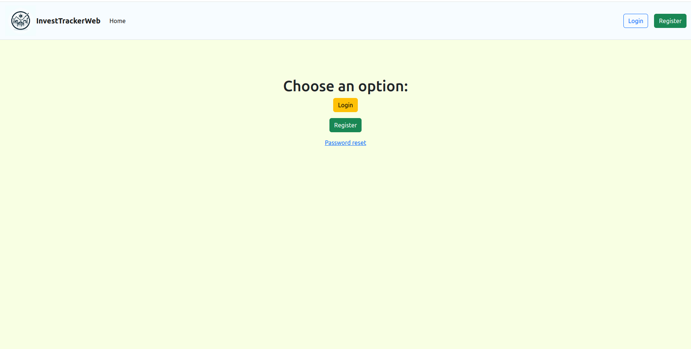

# InvestTrackerWeb

**InvestTrackerWeb** is a web system developed in Python with Django, designed to assist investors in their decisions to buy and sell B3 assets. The system aims to periodically record asset quotes and send email alerts when trading opportunities are identified, based on [B3 tunnels parameters](https://www.b3.com.br/pt_br/solucoes/plataformas/puma-trading-system/para-participantes-e-traders/regras-e-parametros-de-negociacao/tuneis-de-negociacao/) (static, dynamic synchronous and asynchronous). Besides, the web page has an secure authentication system, 

## System and usage description

First, the authentication system, in the **home page** you can choose for login, register, or to change your password, if necessary. After logged in, more options appears at navbar, and a button allowing to logoff.


At the **Search for Assets** page, you can input the ticker of your B3 asset to visualize data about it.


It's delivered both the last asset values and a graphical interface (iterative) from all the data minute by minute from the last day.


At the **Configure your Assets** page is where the user is able to configure what assets are going to be periodically verificated by the web system. (It user has an own asset list database and asset history database)
There's two cards, the first one, in green, allows the insert of a new asset, it polling interval in minutes and all the tunnel type and parameters.
The orange card retrieves a list from all your assets and allows it to be removed.
All the assets configured here will notify the User by email (the email configured at registration) when an asset reaches a tunnel border, recommending to the user to buy, if it reach the lower border or to sell it, when it reach the upper border.


The **Check your Assets** page allows you to retrieve all the information from your configured assets, by selecting it from the drop down menu.


And them is displayed the information as in the search system, but it's displayed the data stored for this asset in the system database, and show a iterative graph and the last data stored by the system in the polling interval.


## Requirements 

To execute this system you need to have installed:
- Python3
- Django
- Pip
- Celery, Redis
- Libraries: matplotlib, pandas, yfinance, plotly

## How to execute
To run the project open three different terminals and in each one execute each of the following commands.

1. **Run django server**
```bash
python3 manage.py runserver
```

2. **Run celery beat**
```bash
celery -A InvestTrackerWeb beat --scheduler django_celery_beat.schedulers:DatabaseScheduler
```

3. **Run celery worker**
```bash
celery -A InvestTrackerWeb worker --loglevel=info
```

3. **Insert the email and password for the server**
```bash
python3 emailRegister.py
```

Open the link "http://127.0.0.1:8000/" in your browser.
